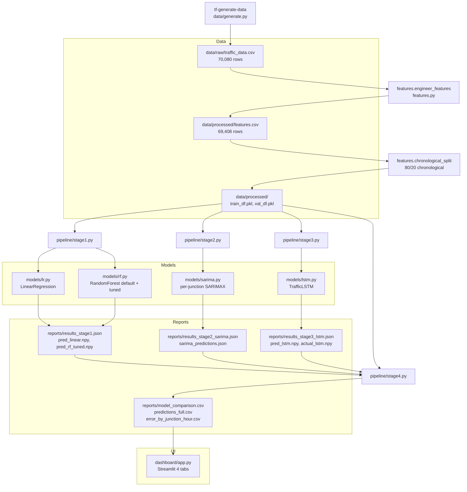
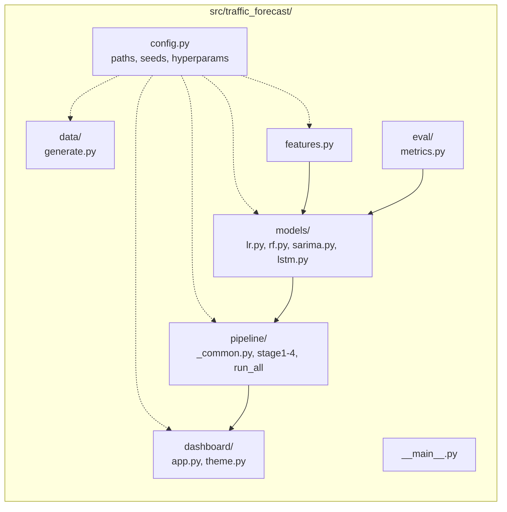
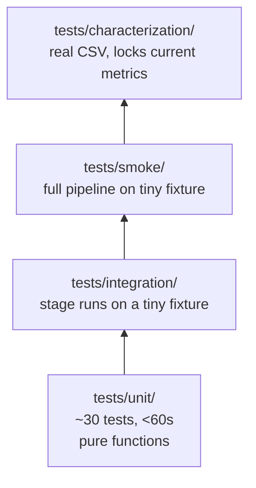

# Architecture

End-to-end data flow for the traffic forecasting pipeline. Generates data,
engineers features, trains four models, combines their predictions, and
serves an interactive dashboard.

## High-level flow

## Package layout

## Console scripts

| Command | What it does |
|---|---|
| `tf-generate-data` | writes `data/raw/traffic_data.csv` |
| `tf-train-stage1` | LR + RF (default + tuned) |
| `tf-train-stage2` | SARIMA per junction |
| `tf-train-stage3` | LSTM (target-scaled, grad-clipped, early-stopped) |
| `tf-combine` | merges reports + builds dashboard inputs |
| `tf-train-all` | stages 1 -> 4 in one process |
| `tf-dashboard` | launches Streamlit |

All commands also available via `python -m traffic_forecast {generate-data|stage1|...}`.

## Determinism

Random sources and how they're handled:

| Source | Seeded? | Where |
|---|---|---|
| Data generation noise, spikes, missing-value mask | yes | `data/generate.py::build_dataset` (reentrant - seed constructed inside the function) |
| RF default + tuned | yes | `random_state=42` on every `RandomForestRegressor` constructor |
| RF grid-search subsample | yes | `np.random.default_rng(0)` in `models/rf.py::train_tuned` |
| SARIMA L-BFGS-B optimization | deterministic | fixed init, no shuffling |
| LSTM | yes | `torch.manual_seed(42); torch.set_num_threads(1)` in `models/lstm.py::train` |

`tf-train-all` from a clean checkout reproduces the metrics within the bands
enforced by `tests/characterization/`.

## Test pyramid

- **Fast loop** (`pytest -m "not slow"`): unit + integration + smoke. ~60s.
- **Slow loop** (`pytest`): adds characterization. ~3 min. Locks the current
  metrics within +-10% bands so a refactor or library bump cannot silently
  regress the results.
- **CI**: ruff + fast tests on Python 3.10 / 3.11 / 3.12 (matrix),
  characterization on push events only.
